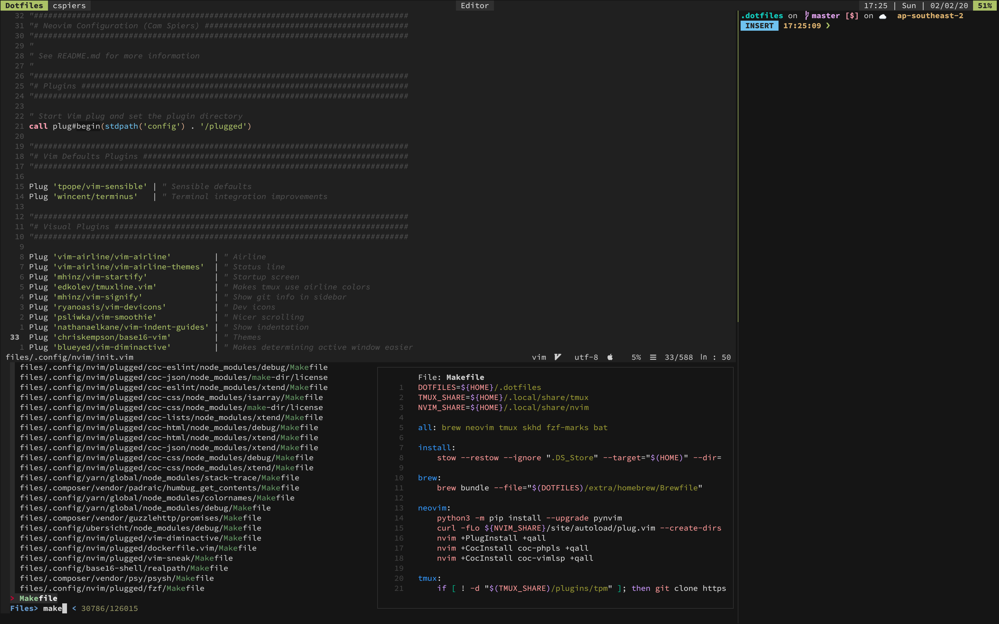

# Dotfiles

macOS environment managed by git and GNU Stow.



## Overview

- [Homebrew Defaults](extra/homebrew/Brewfile)
- [NeoVim Config](files/.config/nvim/init.vim)
- [Tmux Config](files/.tmux.conf)
- [Kitty.app Config](files/.config/kitty/kitty.conf)
- [Bash Runcom](files/.config/.bashrc)
- [Bash Profile](files/.config/.bash_profile)
- [yabai Config](files/.config/yabai/yabairc)
- [skhd Config](files/.config/skhd/skhdrc)
- [macOS Defaults](scripts/macos)

## Installation

```
# Install Homebrew
/usr/bin/ruby -e "$(curl -fsSL https://raw.githubusercontent.com/Homebrew/install/master/install)"

# Clone repo
git clone git@github.com:camspiers/dotfiles.git ~/.dotfiles

cd ~/.dotfiles

make all
make install
```


